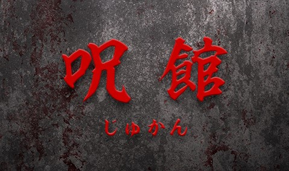

# 呪館 ( じゅかん )

雨の中のある日, 私は大学のサークル仲間と心霊スポットで有名な館を訪れた. そこで見た光景とは..

# ゲーム概要

本作品はプログラミング言語 Java で書かれた 2 次元 RPG ホラーゲームである. プレイヤーは不気味な館に潜入し, 敵のゴーストを懐中電灯ライトで倒しながら, 館から抜け出すためのカギを探索する. 館内には様々なゴーストやアイテムが存在し, 戦略の幅を広げる.

This animation is a "Cat playing on trampoline"!
You can get basic skills for making physics simulations.

# ゲームの設定・ルール

館に潜むゴーストは光に弱い. プレイヤーは所持している懐中電灯ライトをゴーストに当てることで倒すことができる. また倒したゴーストのレベルに応じてスコアを獲得できる. 一方で, ゴーストは透明で通常は見えない. しかし懐中電灯ライトや時々鳴る雷の光で見えることがある.  
ゲームクリアには館に落ちてるカギを入手し, 再度館から脱出する必要がある. カギは一定時間経過すると館のどこかに落ちる.

# 操作方法

- メニュー画面
    - 選択 : 矢印キー ↑↓→←
    - 決定 : ENTER キー
    - 名前入力 : 任意のアルファベットキー
- プレイヤー画面
    - 移動 : 矢印キー ↑↓→←
    - ライト点灯 : F キー
    - 方向のみ転換 : スペースキー + 矢印キー ↑↓→←

# 起動方法

[JDK (Java SE Development Kit)](https://www.oracle.com/java/technologies/downloads/) をPCにインストールした状態でこのリポジトリ内の jar ファイルをダブルクリック.

テスト時の JDK
- AdoptOpenJDK JDK with Hotspot 11.0.4.11 (x64) 

動作確認済み OS
- Windows
- Mac
- Linux

# 開発者

- Yuta Sumiya
- Takeru Sato
- Akinori Fujii

# 著作権等

ゲームのイラストについて一部フリー素材を使用しているため, 商用利用等は控えてください.

# 参考文献

本作品を作成するにあたって大変参考になったブログ : https://aidiary.hatenablog.com/entry/20040918/1251373370